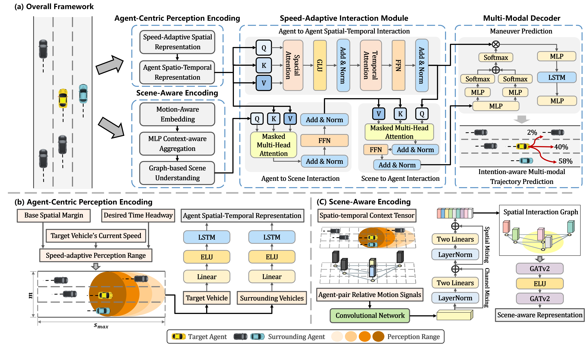

# SZI-Net: A Speed-Aware Zooming Spatio-temporal Interaction Modeling Framework for Vehicle Trajectory Prediction

[]() [](https://opensource.org/licenses/MIT)

This is the official repository for our paper:  
**"SZI-Net: A Speed-Aware Zooming Spatio-temporal Interaction Modeling Framework for Vehicle Trajectory Prediction"**.  
All code, data, and pretrained models will be released upon manuscript acceptance.

---

## 🧠 Overview

Accurate trajectory prediction is a critical yet challenging task for safe and efficient autonomous driving, especially in complex, interactive scenarios. However, many existing methods are constrained by their reliance on predefined, fixed interaction regions and often lack the ability to form a structured understanding of the environment from perception alone.

To overcome these limitations, we propose SZI-Net, a novel forecasting framework inspired by the human-like ability of perceptual zooming. The framework introduces a Speed-Adaptive Interaction Module, which dynamically tailors the perceptual field to the agent's velocity, enabling more focused and context-aware interaction modeling. In parallel, a Scene-Aware Encoder constructs a structured, grid-based representation of the driving environment by learning latent semantic layouts directly from local agent dynamics. These components are tightly integrated via a multi-stage relational reasoning architecture, which alternates between agent-to-scene and scene-to-agent abstraction to achieve a holistic spatio-temporal understanding. 

Extensive experiments conducted on the challenging NGSIM and HighD highway datasets validate the effectiveness of our approach. SZI-Net consistently outperforms current state-of-the-art methods, demonstrating significant improvements in prediction accuracy, particularly over long-term horizons. Furthermore, qualitative analyses show that our model generates diverse and realistic future trajectories that are well-aligned with human driving behavior, successfully anticipating complex lane-change maneuvers where other models often fail.

---

## 🧩 Framework

SZI-Net is a cognitively inspired trajectory prediction framework that dynamically adapts perception and interaction modeling based on an agent’s speed and local scene dynamics.


> **Figure**: Overall architecture of SZI-Net with four main modules: Agent-Centric Perception Encoding, Scene-Aware Encoding, Speed-Adaptive Interaction, and Multi-Modal Decoding.


SZI-Net follows the **encode–interact–decode** paradigm and is composed of the following key modules:

### 🔹 1. Agent-Centric Perception Encoding Module
Constructs a velocity-adaptive dynamic perception space centered on the target agent, and independently encodes the historical trajectories of agents within this space.
### 🔹 2. Scene-Aware Encoding Module
Constructs initial feature representations within the perception space based on the relative motion states of agents, and further enhances local and global scene semantics through motion-aware feature augmentation guided by regional topological relationships.
### 🔹 3. Speed-Adaptive Interaction Module
Integrates scene and agent cues by hierarchically modeling agent-agent and agent-scene interactions, yielding spatio-temporal feature representations enriched with motion and contextual information.
### 🔹 4. Multi-Modal Decoder
Generates probabilistic, maneuver-conditioned future trajectories. By modeling multi-modal distributions, it captures the uncertainty and diversity inherent in real-world driving behavior.

---

## 📈 Experimental Results

SZI-Net is evaluated on two standard benchmarks: **NGSIM** and **HighD**, across prediction horizons from 1 to 5 seconds. The evaluation metric is RMSE (in meters); lower is better.  


### 🚗 NGSIM Results

| Model        | Pub.      | 1s   | 2s   | 3s   | 4s   | 5s   | AVG  |
|--------------|-----------|------|------|------|------|------|------|
| PiP          | ECCV'20   | 0.55 | 1.18 | 1.94 | 2.88 | 4.04 | 2.12 |
| MHA-LSTM     | T-IV'21   | 0.41 | 1.01 | 1.74 | 2.67 | 3.83 | 1.93 |
| iNATran      | T-IM'22   | 0.39 | 0.96 | 1.61 | 2.42 | 3.43 | 1.76 |
| STDAN        | T-ITS'22  | 0.42 | 1.01 | 1.69 | 2.56 | 3.67 | 1.87 |
| WSIP         | AAAI'23   | 0.56 | 1.23 | 2.05 | 3.08 | 4.34 | 2.25 |
| DACR-AMTP    | T-IV'23   | 0.57 | 1.07 | 1.68 | 2.53 | 3.40 | 1.85 |
| BAT          | AAAI'24   | **0.23** | 0.81 | 1.54 | 2.52 | 3.62 | 1.74 |
| HLTP         | T-IV'24   | 0.41 | 0.91 | 1.45 | 2.09 | 2.93 | 1.56 |
| HLTP++       | ECAI'24   | 0.46 | 0.98 | 1.52 | 2.17 | 3.02 | 1.63 |
| GaVa         | ICRA'24   | 0.40 | 0.94 | 1.52 | 2.24 | 3.13 | 1.64 |
| DEMO         | INFFUS'25 | 0.36 | 0.86 | 1.48 | 2.10 | 2.88 | 1.54 |
| CoT-Drive    | T-AI'25   | 0.40 | 0.92 | 1.43 | 2.04 | 2.87 | 1.53 |
| **SZI-Net (Ours)** | —         | **0.23** | **0.63** | **1.20** | **1.83** | **2.53** | **1.28** |

---

### 🛣️ HighD Results

| Model        | Pub.      | 1s   | 2s   | 3s   | 4s   | 5s   | AVG  |
|--------------|-----------|------|------|------|------|------|------|
| PiP          | ECCV'20   | 0.17 | 0.52 | 1.05 | 1.76 | 2.63 | 1.23 |
| MHA-LSTM     | T-IV'21   | 0.06 | 0.09 | 0.24 | 0.59 | 1.18 | 0.43 |
| iNATran      | T-IM'22   | **0.04** | **0.05** | 0.21 | 0.54 | 1.10 | 0.39 |
| STDAN        | T-ITS'22  | 0.19 | 0.27 | 0.48 | 0.91 | 1.66 | 0.70 |
| WSIP         | AAAI'23   | 0.20 | 0.60 | 1.21 | 2.07 | 3.14 | 1.44 |
| DACR-AMTP    | T-IV'23   | 0.10 | 0.17 | 0.31 | 0.54 | 1.01 | 0.42 |
| BAT          | AAAI'24   | 0.08 | 0.14 | **0.20** | 0.44 | 0.62 | 0.30 |
| HLTP         | T-IV'24   | 0.09 | 0.16 | 0.29 | 0.38 | 0.59 | 0.30 |
| HLTP++       | ECAI'24   | 0.11 | 0.17 | 0.30 | 0.47 | 0.75 | 0.36 |
| GaVa         | ICRA'24   | 0.17 | 0.24 | 0.42 | 0.86 | 1.31 | 0.60 |
| DEMO         | INFFUS'25 | 0.06 | 0.14 | 0.25 | 0.44 | 0.70 | 0.32 |
| CoT-Drive    | T-AI'25   | 0.08 | 0.13 | **0.20** | 0.37 | 0.72 | 0.30 |
| **SZI-Net (Ours)** | —         | 0.08 | 0.13 | 0.21 | **0.33** | **0.52** | **0.26** |

---

## 🔧 Installation

> Requirements and setup instructions will be updated upon release.

```bash
# Clone the repository
git clone https://github.com/Marcelaine/SZI-Net.git
cd SZI-Net

# (Optional) Create a virtual environment
conda create -n szinet python=3.8
conda activate szinet

# Install dependencies
pip install -r requirements.txt
